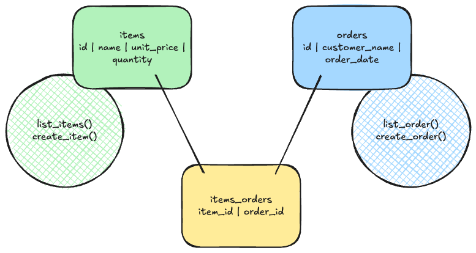

# Shop Manager Solo Project

## User Stories
> As a shop manager     
> So I can know which items I have in stock     
> I want to keep a list of my shop items with their name and unit price.        

> As a shop manager     
> So I can know which items I have in stock         
> I want to know which quantity (a number) I have for each item.        

> As a shop manager     
> So I can manage items     
> I want to be able to create a new item.       

> As a shop manager     
> So I can know which orders were made      
> I want to keep a list of orders with their customer name.     

> As a shop manager     
> So I can know which orders were made      
> I want to assign each order to their corresponding item.      

> As a shop manager     
> So I can know which orders were made      
> I want to know on which date an order was placed.         

> As a shop manager     
> So I can manage orders        
> I want to be able to create a new order.      

Nouns:
items, name, unit price, quantity, orders, customer name, item, date

## Database Design


### Table Overview
```bash
Table: items

Columns: 
id | name | unit_price | quantity
```

```bash
Table: orders

Columns:
id | customer_name | order_date
```

```bash
Table: items_orders

Columns:
item_id | order_id
```

### SQL Seeds
```sql
CREATE TABLE items (
    id SERIAL PRIMARY KEY,
    name VARCHAR(255),
    unit_price DECIMAL(10, 2),
    quantity INT
);

CREATE TABLE orders (
    id SERIAL PRIMARY KEY,
    customer_name VARCHAR(255),
    order_date DATE
);

CREATE TABLE items_orders (
    item_id int,
    order_id int,
    CONSTRAINT fk_item FOREIGN KEY(item_id) REFERENCES items(id) ON DELETE CASCADE,
    CONSTRAINT fk_order FOREIGN KEY(order_id) REFERENCES orders(id) ON DELETE CASCADE,
    PRIMARY KEY (item_id, order_id)
);
```

### Seed the Database
```bash
psql 127.0.0.1 -h shop_manager < seeds/shop_manager.sql
```

## The Class Interfaces
### Class Definitions
```py
# Table name: items

# Model class
# in lib/item.py
class Item

# Repository class
# in lib/item_repository.py
class ItemRepository
```
```py
# Table name: orders

# Model class
# in lib/order.py
class Order

# Repository class
# in lib/order_repository.py
class OrderRepository
```

### Model Class Implementations
```py
# Table name: items

# Model class
# in lib/item.py
class Item:
    def __init__(self):
        self.id = 0
        self.name = ""
        self.unit_price = 0.00
        self.quantity = 1
```

```py
# Table name: orders

# Model class
# in lib/order.py
"""
!!!     IMPORT DATETIME     !!!
"""
class Order:
    def __init__(self):
        self.id = 0
        self.customer_name = ""
        self.order_date = date(2025, 12, 19)
```

### Repository Class Implementations
```py
# Table name: items

# Repository class
# in lib/item_repository.py
class ItemRepository:
    def __init__(connection):
        # establish connection to database
        pass

    # Select all records
    # No arguments
    def list_items():
        # Executes SQL query:
        # SELECT id, name, unit_price, quantity FROM items;

        # Returns list of Item objects
        pass

    # Select a single record by id
    # 1 argument: item_id (integer)
    def find_by_item_id(item_id):
        # Executes SQL query
        # SELECT id, name, unit_price, quantity FROM items WHERE id = %s;

    # Create new record
    # 3 arguments: name (string), unit_price (decimal), quantity (integer)
    def create_new_item(name, unit_price, quantity):
        # Executes SQL query:
        # INSERT INTO items (name, unit_price, quantity) 
        #   VALUES (%s, %s, %s);
        pass
```

```py
# Table name: orders

# Repository class
# in lib/order_repository.py
class OrderRepository:
    def __init__(connection):
        # establish connection to database
        pass

    # Select all records
    # No arguments
    def list_orders():
        # Executes SQL query
        # SELECT id, customer_name, order_date FROM orders;

        # Returns list of Order objects
        pass

    # Select a single record by id
    # 1 argument: order_id (integer)
    def find_by_order_id(order_id):
        # Executes SQL query
        # SELECT id, customer_name, order_date FROM orders WHERE id = %s;
        pass

    # Create new record
    # 2 arguments customer_name (string), order_date (date)
    def create_new_order(customer_name, order_date):
        # Executes SQL query
        # INSERT INTO orders (customer_name, order_date)
        #   VALUES (%s, %s);
        pass
```

## Test Examples
### `Item` & `ItemRepository`
```py
# 1
# Get all items

repo = ItemRepository()

items = repo.list_items()

len(items) == 5
items == [
    Item(1, 'Laptop', 899.99, 15),
    Item(2, 'Wireless Mouse', 24.99, 50),
    Item(3, 'USB-C Cable', 12.99, 100),
    Item(4, 'Mechanical Keyboard', 129.99, 25),
    Item(5, 'Headphones', 79.99, 40)
]
```

```py
# 2
# Item constructs

item = Item(id, name, unit_price, quantity)

item.id = id
item.name = name
item.unit_price = unit_price
item.quantity = quantity
```

```py
# 3
# Two identical Items are equal
item1 = Item(id, name, unit_price, quantity)
item2 = Item(id, name, unit_price, quantity)

item1 == item2
```

```py
# 4
# Item is formatted

item = Item(id, name, unit_price, quantity)

str(item) == "Item(id, name, unit_price, quantity)"
```

```py
# 5
# Finds an Item by id

repo = ItemRepository()

item = repo.find_by_item_id(1)

item == Item(1, 'Laptop', 899.99, 5)
```

```py
# 6
# Creates a new Item

repo = ItemRepository()

repo.create_new_item('Desk Mat XL', 19.99, 1)

len(repo.list_items()) == 6

item = repo.find_by_item_id(6)

item == Item(6, 'Desk Mat XL', 19.99, 1)
```

### `Order` & `OrderRepository`
```py
# 1
# Get all orders

repo = OrderRepository()

orders = repo.list_orders()

len(orders) == 5
orders == [
    Order(1, 'Alice Johnson', date(2024, 12, 15)),
    Order(2, 'Bob Smith', date(2024, 12, 16)),
    Order(3, 'Carol Williams', date(2024, 12, 17)),
    Order(4, 'David Brown', date(2024, 12, 18)),
    Order(5, 'Alice Johnson', date(2024, 12, 19))
]
```

```py
# 2
# Order constructs

order = Order(id, customer_name, order_date)

order.id = id
order.customer_name = customer_name
order.order_date = order_date
```

```py
# 3
# Two identical Orders are equal
order1 = Order(id, customer_name, order_date)
order2 = Order(id, customer_name, order_date)


order1 == order2
```

```py
# 4
# Order is formatted

order = Order(id, customer_name, order_date)

str(order) == "Order(id, customer_name, order_date)"
```

```py
# 5
# Finds an Order by id

repo = OrderRepository()

order = repo.find_by_order_id(3)

order == Order(3, 'Carol Williams', date(2024, 12, 17))
```

```py
# 6
# Creates a new Order

repo = OrderRepository()

repo.create_new_order('Kris Kringle', '2024-12-24')

len(repo.list_orders()) == 6

order = repo.find_by_order_id(6)

order == Order(6, 'Kris Kringle', date(2024, 12, 24))
```